# .NET 10 Upgrade Plan - DiskSpaceService

## Table of Contents

- [Executive Summary](#executive-summary)
- [Migration Strategy](#migration-strategy)
- [Detailed Dependency Analysis](#detailed-dependency-analysis)
- [Project-by-Project Plans](#project-by-project-plans)
- [Package Update Reference](#package-update-reference)
- [Breaking Changes Catalog](#breaking-changes-catalog)
- [Testing & Validation Strategy](#testing--validation-strategy)
- [Risk Management](#risk-management)
- [Complexity & Effort Assessment](#complexity--effort-assessment)
- [Source Control Strategy](#source-control-strategy)
- [Success Criteria](#success-criteria)

---

## Executive Summary

### Scenario Description
Upgrade **DiskSpaceService** solution from .NET 8.0 to .NET 10.0 (Long Term Support).

### Scope
- **Projects Affected**: 1 project (DiskSpaceService.csproj)
- **Current State**: .NET 8.0 Worker Service application
- **Target State**: .NET 10.0 Worker Service application
- **Total Lines of Code**: 1,449
- **Estimated Code Impact**: 2+ lines (0.1% of codebase)

### Selected Strategy
**All-At-Once Strategy** - Single atomic upgrade operation for all components.

**Rationale**: 
- Single project with zero dependencies (standalone)
- Low complexity (1,449 LOC, 2 package updates, 2 API incompatibilities)
- No security vulnerabilities identified
- Clean dependency structure (no circular dependencies)
- All required package versions available for .NET 10.0

### Discovered Metrics
- **Project Count**: 1
- **Dependency Depth**: 0 (standalone)
- **Risk Level**: Low
- **Package Updates Required**: 2 (Microsoft.Extensions.Hosting, Microsoft.Extensions.Hosting.WindowsServices)
- **API Compatibility Issues**: 2 (source incompatible TimeSpan methods)
- **Security Vulnerabilities**: None

### Complexity Classification
**Simple Solution** - enables fast batch execution with atomic upgrade.

### Iteration Strategy
- **Phase 1**: Discovery & Classification (3 iterations) ✓
- **Phase 2**: Foundation sections (3 iterations)
- **Phase 3**: Consolidated detail generation (1-2 iterations for all project details)
- **Expected Total**: 7-8 iterations

---

## Migration Strategy

### Approach Selection: All-At-Once

**Selected Strategy**: All-At-Once Strategy

**Justification**:
1. **Single Project**: Only one project exists (DiskSpaceService.csproj)
2. **No Dependencies**: Zero project-to-project dependencies
3. **Small Codebase**: 1,449 lines of code
4. **Low Complexity**: Only 2 package updates and 2 source-incompatible API calls
5. **No Security Issues**: No vulnerable packages identified
6. **Clear Compatibility**: All required package versions available for .NET 10.0

### All-At-Once Strategy Rationale

The All-At-Once approach is ideal for this scenario because:
- **Fastest Completion**: Single coordinated operation minimizes total time
- **No Multi-Targeting Complexity**: No need for intermediate netstandard targeting
- **Clean Dependency Resolution**: All packages upgrade simultaneously
- **Simple Coordination**: Single project requires no cross-project coordination
- **Atomic Testing**: Complete validation in one pass

### Dependency-Based Ordering

**Not Applicable** - With zero project dependencies, no ordering constraints exist. All changes occur simultaneously.

### Execution Approach

**Single Atomic Operation**:
1. Update TargetFramework property in DiskSpaceService.csproj
2. Update all package references (Microsoft.Extensions.Hosting packages)
3. Restore dependencies
4. Build solution and address compilation errors from API incompatibilities
5. Verify solution builds with 0 errors

**No Intermediate States** - The project transitions directly from net8.0 to net10.0 in one coordinated update.

---

## Detailed Dependency Analysis

### Dependency Graph Summary

The solution consists of a **single standalone project** with no project-to-project dependencies.

```mermaid
flowchart LR
    P1["<b>📦 DiskSpaceService.csproj</b><br/><small>net8.0 → net10.0</small>"]
```



### Project Groupings by Migration Phase

**Phase 1: Atomic Upgrade (All Projects)**
- DiskSpaceService.csproj (Worker Service)

**Rationale**: With only one project and no dependencies, all changes are applied as a single atomic operation.

### Critical Path Identification

**Single Path**: DiskSpaceService.csproj → .NET 10.0

No blocking dependencies exist. The upgrade can proceed immediately.

### Circular Dependencies

**None** - This is a standalone project with no project references.

---

## Project-by-Project Plans

### DiskSpaceService.csproj

**Current State**: 
- **Target Framework**: net8.0
- **Project Type**: Worker Service (DotNetCoreApp)
- **SDK Style**: True
- **Lines of Code**: 1,449
- **Code Files**: 16
- **Files with Issues**: 3
- **Dependencies**: 0 project references
- **Dependants**: 0 projects
- **NuGet Packages**: 3 total
  - Microsoft.Data.SqlClient 6.1.3 (Compatible)
  - Microsoft.Extensions.Hosting 8.0.1 (Needs Update)
  - Microsoft.Extensions.Hosting.WindowsServices 8.0.1 (Needs Update)

**Target State**: 
- **Target Framework**: net10.0
- **Updated Packages**: 2 packages to update

---

#### Migration Steps

##### 1. Prerequisites
- ✅ .NET 10 SDK installed and verified
- ✅ Currently on `upgrade-to-NET10` branch
- ✅ Pending changes committed
- ✅ All dependencies compatible with .NET 10

##### 2. Update Project File (DiskSpaceService.csproj)

**Change TargetFramework**:
```xml
<!-- Before -->
<TargetFramework>net8.0</TargetFramework>

<!-- After -->
<TargetFramework>net10.0</TargetFramework>
```

##### 3. Package Updates

Update the following PackageReference elements:

| Package | Current Version | Target Version | Reason |
|---------|----------------|----------------|--------|
| Microsoft.Extensions.Hosting | 8.0.1 | 10.0.3 | Framework compatibility - aligns with .NET 10 |
| Microsoft.Extensions.Hosting.WindowsServices | 8.0.1 | 10.0.3 | Framework compatibility - Windows Service hosting for .NET 10 |
| Microsoft.Data.SqlClient | 6.1.3 | 6.1.3 | ✅ Already compatible - no update needed |

**Project File Changes**:
```xml
<!-- Update these PackageReferences -->
<PackageReference Include="Microsoft.Extensions.Hosting" Version="10.0.3" />
<PackageReference Include="Microsoft.Extensions.Hosting.WindowsServices" Version="10.0.3" />
<!-- Keep as-is -->
<PackageReference Include="Microsoft.Data.SqlClient" Version="6.1.3" />
```

##### 4. Expected Breaking Changes

**Source Incompatibilities** (2 occurrences):

1. **System.TimeSpan.FromMinutes(System.Double)**
   - **Issue**: Method signature changed in .NET 10
   - **Location**: Code files using `TimeSpan.FromMinutes(doubleValue)`
   - **Fix**: Use explicit cast or updated overload
   - **Example**:
     ```csharp
     // Before (.NET 8)
     var interval = TimeSpan.FromMinutes(5.5);

     // After (.NET 10 - Option 1: Explicit cast)
     var interval = TimeSpan.FromMinutes((double)5.5);

     // After (.NET 10 - Option 2: Use integer overload if appropriate)
     var interval = TimeSpan.FromMinutes(5) + TimeSpan.FromSeconds(30);
     ```

2. **System.TimeSpan.FromSeconds(System.Double)**
   - **Issue**: Method signature changed in .NET 10
   - **Location**: Code files using `TimeSpan.FromSeconds(doubleValue)`
   - **Fix**: Use explicit cast or updated overload
   - **Example**:
     ```csharp
     // Before (.NET 8)
     var delay = TimeSpan.FromSeconds(30.5);

     // After (.NET 10 - Option 1: Explicit cast)
     var delay = TimeSpan.FromSeconds((double)30.5);

     // After (.NET 10 - Option 2: Use integer overload)
     var delay = TimeSpan.FromSeconds(30) + TimeSpan.FromMilliseconds(500);
     ```

**Note**: These are **source incompatibilities**, not runtime breaking changes. Code will fail to compile until addressed.

##### 5. Code Modifications

**Areas Requiring Review** (3 files with incidents):

1. **TimeSpan Usage** (2 occurrences across 3 files)
   - Review all `TimeSpan.FromMinutes()` calls
   - Review all `TimeSpan.FromSeconds()` calls
   - Apply explicit casts or use alternative overloads
   - Verify numeric literals are properly typed

2. **Worker Service Pattern Validation**
   - Verify `BackgroundService` implementations still function
   - Confirm `IHostedService` registration unchanged
   - Validate dependency injection patterns

3. **Configuration System**
   - Ensure `IConfiguration` usage patterns compatible
   - Verify `IOptions<T>` patterns unchanged
   - Validate `appsettings.json` loading

##### 6. Testing Strategy

**Build Validation**:
- [ ] Project builds without errors
- [ ] Project builds without warnings
- [ ] All dependencies restored successfully
- [ ] Output assembly targets net10.0

**Functional Testing**:
- [ ] Worker service starts successfully
- [ ] Background tasks execute on schedule
- [ ] Disk space monitoring functions correctly
- [ ] SQL reporting works as expected
- [ ] Alert mechanisms function (email/GroupMe)
- [ ] Windows Service installation succeeds
- [ ] Service restarts correctly
- [ ] Logs are generated properly

**Integration Testing**:
- [ ] Database connectivity verified
- [ ] SQL operations (INSERT/SELECT) function
- [ ] Email sending works (if configured)
- [ ] GroupMe notifications work (if configured)
- [ ] Configuration file parsing successful

**Performance Testing**:
- [ ] Service startup time acceptable
- [ ] Memory usage comparable to .NET 8 version
- [ ] CPU usage comparable to .NET 8 version
- [ ] No performance regressions in monitoring loops

##### 7. Validation Checklist

Pre-Deployment:
- [ ] ✅ Solution builds with 0 errors
- [ ] ✅ Solution builds with 0 warnings
- [ ] ✅ All NuGet packages restored
- [ ] ✅ No security vulnerabilities in dependencies
- [ ] ✅ Output targets net10.0
- [ ] ✅ TimeSpan API calls updated and compiling
- [ ] ✅ Worker service logic unchanged

Post-Deployment:
- [ ] ✅ Service installs on Windows Server
- [ ] ✅ Service starts automatically
- [ ] ✅ Monitoring executes on configured interval
- [ ] ✅ Alerts fire correctly when thresholds exceeded
- [ ] ✅ SQL logging functions
- [ ] ✅ No runtime exceptions in logs
- [ ] ✅ Service survives machine reboot

---

## Package Update Reference

### Common Package Updates (Affecting All Projects)

| Package | Current | Target | Projects Affected | Update Reason |
|---------|---------|--------|-------------------|---------------|
| Microsoft.Extensions.Hosting | 8.0.1 | 10.0.3 | DiskSpaceService.csproj | Framework compatibility - .NET 10 hosting infrastructure |
| Microsoft.Extensions.Hosting.WindowsServices | 8.0.1 | 10.0.3 | DiskSpaceService.csproj | Framework compatibility - Windows Service lifetime management for .NET 10 |

### Compatible Packages (No Update Needed)

| Package | Current Version | Projects | Notes |
|---------|----------------|----------|-------|
| Microsoft.Data.SqlClient | 6.1.3 | DiskSpaceService.csproj | ✅ Already compatible with .NET 10 |

### Package Update Details

#### Microsoft.Extensions.Hosting (8.0.1 → 10.0.3)

**Purpose**: Core hosting infrastructure for .NET applications

**Update Reason**: 
- Align with .NET 10 framework
- Access to .NET 10 hosting improvements
- Ensure compatibility with .NET 10 runtime

**Breaking Changes**: 
- None expected for standard Worker Service patterns
- API surface remains stable across .NET 8 → 10

**Validation**:
- Verify `IHost` and `IHostBuilder` usage unchanged
- Confirm dependency injection container functionality
- Test application lifetime events (Started, Stopping, Stopped)

---

#### Microsoft.Extensions.Hosting.WindowsServices (8.0.1 → 10.0.3)

**Purpose**: Windows Service hosting capabilities for .NET applications

**Update Reason**:
- Align with .NET 10 framework
- Maintain Windows Service integration
- Ensure service lifetime management compatibility

**Breaking Changes**:
- None expected for standard Windows Service scenarios
- `UseWindowsService()` extension method unchanged

**Validation**:
- Verify service installs with `sc.exe` or installer
- Confirm service starts/stops correctly
- Test service recovery options
- Validate logging to Windows Event Log (if used)

---

#### Microsoft.Data.SqlClient (6.1.3 - No Change)

**Purpose**: SQL Server database connectivity

**Status**: ✅ **Already Compatible** with .NET 10

**Action**: None required - keep current version

**Notes**:
- Version 6.1.3 supports .NET 8 through .NET 10
- No update needed for framework compatibility
- Consider updating in future for security patches or new features (not required for this upgrade)

---

## Breaking Changes Catalog

### Overview

**Total Breaking Changes**: 2 source incompatibilities

**Impact Level**: Low - All issues are compilation-time (source incompatible), not runtime

**Affected Files**: 3 code files contain TimeSpan API usage

---

### API-Level Breaking Changes

#### 1. System.TimeSpan.FromMinutes(System.Double)

**Category**: 🟡 Source Incompatible

**Occurrences**: 1

**Severity**: Low

**Description**:
The `TimeSpan.FromMinutes(double)` method signature has changed in .NET 10, requiring explicit type handling for numeric literals or variables.

**Impact**:
- Code will not compile until addressed
- No runtime behavior change once fixed
- Simple fix with explicit cast or alternative approach

**Affected Patterns**:
```csharp
// Pattern 1: Direct numeric literal
var interval = TimeSpan.FromMinutes(5.5);

// Pattern 2: Variable or computed value
double minutes = GetMinutesFromConfig();
var interval = TimeSpan.FromMinutes(minutes);
```

**Resolution Strategies**:

**Option 1: Explicit Cast (Minimal Change)**
```csharp
// Explicitly cast to double
var interval = TimeSpan.FromMinutes((double)5.5);
var interval = TimeSpan.FromMinutes((double)minutes);
```

**Option 2: Integer Overload (If Precision Not Needed)**
```csharp
// Use integer overload + additional precision if needed
var interval = TimeSpan.FromMinutes(5) + TimeSpan.FromSeconds(30);
```

**Option 3: TimeSpan Constructor**
```csharp
// Use constructor for precise control
var interval = new TimeSpan(hours: 0, minutes: 5, seconds: 30);
```

**Validation**:
- Verify all `TimeSpan.FromMinutes()` calls compile
- Confirm time interval behavior unchanged
- Test scheduling/timing logic thoroughly

---

#### 2. System.TimeSpan.FromSeconds(System.Double)

**Category**: 🟡 Source Incompatible

**Occurrences**: 1

**Severity**: Low

**Description**:
The `TimeSpan.FromSeconds(double)` method signature has changed in .NET 10, requiring explicit type handling for numeric literals or variables.

**Impact**:
- Code will not compile until addressed
- No runtime behavior change once fixed
- Simple fix with explicit cast or alternative approach

**Affected Patterns**:
```csharp
// Pattern 1: Direct numeric literal
var delay = TimeSpan.FromSeconds(30.5);

// Pattern 2: Variable or computed value
double seconds = CalculateDelay();
var delay = TimeSpan.FromSeconds(seconds);
```

**Resolution Strategies**:

**Option 1: Explicit Cast (Minimal Change)**
```csharp
// Explicitly cast to double
var delay = TimeSpan.FromSeconds((double)30.5);
var delay = TimeSpan.FromSeconds((double)seconds);
```

**Option 2: Integer Overload (If Precision Not Needed)**
```csharp
// Use integer overload + additional precision if needed
var delay = TimeSpan.FromSeconds(30) + TimeSpan.FromMilliseconds(500);
```

**Option 3: TimeSpan Constructor**
```csharp
// Use constructor for precise control
var delay = new TimeSpan(hours: 0, minutes: 0, seconds: 30, milliseconds: 500);
```

**Validation**:
- Verify all `TimeSpan.FromSeconds()` calls compile
- Confirm time interval behavior unchanged
- Test delay/timeout logic thoroughly

---

### Framework-Level Changes

**Worker Service Template**: No breaking changes expected

- `BackgroundService` base class unchanged
- `IHostedService` interface unchanged
- `ExecuteAsync(CancellationToken)` signature unchanged
- Windows Service integration unchanged

**Configuration System**: No breaking changes expected

- `IConfiguration` interface unchanged
- `IOptions<T>` pattern unchanged
- JSON configuration providers unchanged
- Environment variable support unchanged

**Dependency Injection**: No breaking changes expected

- `IServiceCollection` extensions unchanged
- Service lifetime management unchanged
- Scoped service creation unchanged

---

### Package-Specific Breaking Changes

#### Microsoft.Extensions.Hosting (8.0.1 → 10.0.3)

**Breaking Changes**: None identified for standard Worker Service scenarios

**Notes**:
- Core abstractions (`IHost`, `IHostBuilder`, `IHostedService`) stable
- Application lifetime events unchanged
- Generic host pattern unchanged

**Validation Points**:
- Service registration and resolution
- Startup/shutdown sequencing
- Configuration loading
- Logging integration

---

#### Microsoft.Extensions.Hosting.WindowsServices (8.0.1 → 10.0.3)

**Breaking Changes**: None identified for standard Windows Service scenarios

**Notes**:
- `UseWindowsService()` extension unchanged
- Service Control Manager integration stable
- Event log integration unchanged

**Validation Points**:
- Service installation
- Service start/stop/restart
- Windows Event Log writing
- Service recovery configuration

---

### Migration Checklist

Use this checklist to systematically address each breaking change:

**TimeSpan API Updates**:
- [ ] Locate all `TimeSpan.FromMinutes()` calls in codebase
- [ ] Apply explicit cast or alternative approach
- [ ] Locate all `TimeSpan.FromSeconds()` calls in codebase
- [ ] Apply explicit cast or alternative approach
- [ ] Build solution to verify compilation
- [ ] Review compiler warnings for additional TimeSpan usage

**Framework Compatibility**:
- [ ] Verify `BackgroundService` implementations compile
- [ ] Confirm `ExecuteAsync` logic unchanged
- [ ] Validate dependency injection registrations
- [ ] Test configuration loading
- [ ] Verify logging integration

**Package Compatibility**:
- [ ] Update Microsoft.Extensions.Hosting to 10.0.3
- [ ] Update Microsoft.Extensions.Hosting.WindowsServices to 10.0.3
- [ ] Restore all dependencies
- [ ] Verify no package conflicts
- [ ] Check for deprecation warnings

**Testing**:
- [ ] Run all unit tests (if present)
- [ ] Perform integration testing
- [ ] Test Windows Service installation
- [ ] Verify service behavior in production-like environment

---

## Testing & Validation Strategy

### Overview

Comprehensive testing ensures the upgrade maintains functionality, performance, and reliability of the Worker Service.

---

### Phase Testing: Atomic Upgrade Validation

Since this is an All-At-Once upgrade with a single project, all testing occurs after the atomic upgrade completes.

**Objectives**:
- Verify successful compilation with .NET 10
- Confirm all functionality preserved
- Validate Windows Service integration
- Ensure no performance regressions

---

### Level 1: Build & Compilation Testing

**Executed After**: Project file and package updates applied

**Validation Steps**:
1. **Clean Build**
   - [ ] Run `dotnet clean`
   - [ ] Delete `bin/` and `obj/` folders
   - [ ] Run `dotnet restore`
   - [ ] Run `dotnet build`
   - [ ] Verify: **0 errors, 0 warnings**

2. **Package Verification**
   - [ ] Confirm Microsoft.Extensions.Hosting 10.0.3 restored
   - [ ] Confirm Microsoft.Extensions.Hosting.WindowsServices 10.0.3 restored
   - [ ] Confirm Microsoft.Data.SqlClient 6.1.3 restored
   - [ ] Check for package conflicts: **None expected**

3. **Output Verification**
   - [ ] Verify `DiskSpaceService.dll` targets net10.0
   - [ ] Verify `DiskSpaceService.exe` (if self-contained) generated
   - [ ] Check assembly metadata for correct version

**Success Criteria**: Clean build with zero errors and warnings.

---

### Level 2: Unit Testing (If Tests Exist)

**Executed After**: Build succeeds

**Scope**: Individual component testing

**Test Categories**:
1. **Drive Scanning Logic**
   - [ ] Test drive enumeration
   - [ ] Test free space calculation
   - [ ] Test threshold comparison logic
   - [ ] Verify edge cases (drives unavailable, permissions denied)

2. **Alert Logic**
   - [ ] Test alert trigger conditions
   - [ ] Test alert message formatting
   - [ ] Test cooldown/throttling logic
   - [ ] Verify multiple alert sender coordination

3. **Configuration Parsing**
   - [ ] Test XML config loading
   - [ ] Test default value handling
   - [ ] Test invalid configuration scenarios
   - [ ] Verify configuration validation

4. **SQL Reporting**
   - [ ] Test SQL connection establishment (mocked)
   - [ ] Test SQL INSERT statement generation
   - [ ] Test connection retry logic
   - [ ] Verify data serialization

**Success Criteria**: All unit tests pass with no failures.

---

### Level 3: Integration Testing

**Executed After**: Unit tests pass (or if no unit tests, after build succeeds)

**Scope**: Component interaction and external dependencies

**Test Scenarios**:

1. **Service Startup**
   - [ ] Start service in console mode: `dotnet run`
   - [ ] Verify service initializes without exceptions
   - [ ] Verify configuration loads successfully
   - [ ] Verify background worker starts
   - [ ] Check logs for startup messages

2. **Disk Monitoring Execution**
   - [ ] Verify drive scanning executes on schedule
   - [ ] Confirm free space reported accurately
   - [ ] Validate timing intervals (check logs for execution timestamps)
   - [ ] Ensure no exceptions during monitoring loop

3. **Database Integration**
   - [ ] Configure SQL Server connection (test database)
   - [ ] Verify connection established
   - [ ] Confirm data inserted into database
   - [ ] Validate data accuracy (free space values, timestamps)
   - [ ] Test connection failure handling

4. **Alert System Integration**
   - [ ] Trigger alert condition (artificially lower threshold)
   - [ ] Verify email sent (if email configured)
   - [ ] Verify GroupMe notification sent (if GroupMe configured)
   - [ ] Confirm alert cooldown prevents spam
   - [ ] Validate alert message content

5. **Configuration Changes**
   - [ ] Modify configuration file while service running
   - [ ] Verify configuration reloads (if hot-reload supported)
   - [ ] Test invalid configuration handling

**Success Criteria**: All integration scenarios function correctly with no exceptions.

---

### Level 4: Windows Service Testing

**Executed After**: Integration tests pass

**Scope**: Windows Service-specific functionality

**Test Steps**:

1. **Service Installation**
   ```powershell
   # Install service
   sc.exe create DiskSpaceService binPath="C:\Path\To\DiskSpaceService.exe"
   ```
   - [ ] Verify service installs without errors
   - [ ] Confirm service appears in Services console
   - [ ] Verify service configured as Manual or Automatic

2. **Service Lifecycle**
   ```powershell
   # Start service
   sc.exe start DiskSpaceService
   ```
   - [ ] Verify service starts successfully
   - [ ] Check Windows Event Log for startup entries
   - [ ] Confirm worker executing (check database or logs)

   ```powershell
   # Stop service
   sc.exe stop DiskSpaceService
   ```
   - [ ] Verify service stops gracefully
   - [ ] Confirm shutdown completes within timeout
   - [ ] Check logs for clean shutdown

3. **Service Restart**
   - [ ] Restart service: `sc.exe stop DiskSpaceService && sc.exe start DiskSpaceService`
   - [ ] Verify service recovers state (if applicable)
   - [ ] Confirm monitoring resumes

4. **System Reboot Test**
   - [ ] Configure service as Automatic start
   - [ ] Reboot Windows machine
   - [ ] Verify service starts automatically after boot
   - [ ] Confirm monitoring begins without manual intervention

5. **Service Recovery**
   - [ ] Configure service recovery options (restart on failure)
   - [ ] Simulate service crash (if safe to do so)
   - [ ] Verify service restarts automatically
   - [ ] Check Event Log for recovery actions

**Success Criteria**: Service installs, starts, stops, and recovers correctly.

---

### Level 5: Performance & Stress Testing

**Executed After**: Windows Service tests pass

**Scope**: Performance characteristics and resource usage

**Metrics to Monitor**:

1. **Startup Performance**
   - [ ] Measure service startup time (from start command to first monitoring cycle)
   - [ ] Compare to .NET 8 baseline (if available)
   - [ ] Verify startup < 5 seconds (or project-specific threshold)

2. **Runtime Resource Usage**
   - [ ] Monitor CPU usage (Task Manager or Performance Monitor)
   - [ ] Monitor memory usage (private working set)
   - [ ] Monitor handle count
   - [ ] Compare to .NET 8 baseline
   - [ ] Verify no memory leaks over extended period (24+ hours)

3. **Monitoring Cycle Performance**
   - [ ] Measure time to scan all drives
   - [ ] Measure time to write to database
   - [ ] Verify cycle completes within configured interval
   - [ ] Ensure no performance degradation over time

4. **Stress Testing**
   - [ ] Configure short monitoring interval (e.g., 10 seconds)
   - [ ] Run for extended period (1+ hour)
   - [ ] Verify stable resource usage
   - [ ] Confirm no exceptions or errors

**Success Criteria**: Performance meets or exceeds .NET 8 baseline; no resource leaks detected.

---

### Level 6: End-to-End Scenario Testing

**Executed After**: Performance testing complete

**Scope**: Real-world usage scenarios

**Test Cases**:

1. **Scenario: Normal Operation**
   - Service runs for 24 hours
   - All drives monitored successfully
   - Data logged to database
   - No alerts triggered (sufficient free space)
   - **Expected**: No errors, stable operation

2. **Scenario: Low Disk Space Alert**
   - Free space falls below warning threshold
   - **Expected**: Alert email/GroupMe sent
   - **Expected**: Alert logged to database
   - **Expected**: Cooldown prevents duplicate alerts

3. **Scenario: Database Unavailable**
   - SQL Server stopped or unreachable
   - **Expected**: Service logs error
   - **Expected**: Service continues monitoring (resilient)
   - **Expected**: Service reconnects when database available

4. **Scenario: Configuration Error**
   - Invalid configuration file provided
   - **Expected**: Service logs validation errors
   - **Expected**: Service uses defaults or fails gracefully
   - **Expected**: Clear error messages for troubleshooting

5. **Scenario: Multiple Drives Low Space**
   - Multiple drives below threshold simultaneously
   - **Expected**: Alerts sent for each drive
   - **Expected**: Alert logic handles concurrency
   - **Expected**: No exceptions or race conditions

**Success Criteria**: All scenarios behave as expected with proper error handling.

---

### Smoke Test (Quick Validation)

**Purpose**: Fast sanity check after any code change

**Duration**: < 5 minutes

**Steps**:
1. Build solution: `dotnet build` → **0 errors**
2. Run in console mode: `dotnet run` → **Starts without exceptions**
3. Wait 1-2 monitoring cycles → **Check logs for success messages**
4. Stop service (Ctrl+C) → **Graceful shutdown**

**When to Execute**: After each significant change (e.g., fixing TimeSpan API calls)

---

### Test Automation Recommendations

Consider automating the following:

1. **Unit Tests**: Run on every build
2. **Integration Tests**: Run nightly or on pull requests
3. **Performance Baselines**: Establish and track over time
4. **Smoke Tests**: Run on every commit

**Tooling Suggestions**:
- xUnit or NUnit for unit tests
- FluentAssertions for readable assertions
- Moq for mocking dependencies
- BenchmarkDotNet for performance testing (future enhancement)

---

### Testing Checklist Summary

**Pre-Deployment Validation**:
- [ ] ✅ Build succeeds with 0 errors, 0 warnings
- [ ] ✅ All unit tests pass (if present)
- [ ] ✅ Integration tests pass
- [ ] ✅ Service installs and starts
- [ ] ✅ Monitoring executes correctly
- [ ] ✅ Database logging works
- [ ] ✅ Alerts function correctly
- [ ] ✅ Performance acceptable
- [ ] ✅ End-to-end scenarios validated

**Post-Deployment Validation**:
- [ ] ✅ Service running in production environment
- [ ] ✅ Monitoring 24+ hours without issues
- [ ] ✅ No unexpected errors in logs
- [ ] ✅ Resource usage stable

**Rollback Criteria**:
If any of these occur, consider rolling back:
- Build failures that cannot be resolved quickly
- Runtime exceptions not present in .NET 8
- Performance degradation > 20%
- Data integrity issues
- Service instability (crashes, hangs)

---

## Risk Management

### Risk Assessment

| Risk Category | Level | Description | Mitigation |
|--------------|-------|-------------|------------|
| Build Failures | Low | 2 source-incompatible API calls in TimeSpan usage | Address during compilation; fixes are straightforward (method signature changes) |
| Package Compatibility | Low | All packages have .NET 10-compatible versions | Update Microsoft.Extensions packages to 10.0.3 |
| Runtime Behavior | Low | Worker Service patterns unchanged between .NET 8 and 10 | Standard testing validates service behavior |
| Deployment Impact | Low | Single executable deployment | Test Windows Service installation post-upgrade |

### Overall Risk Level: **Low**

**Rationale**:
- Single standalone project
- Small codebase (1,449 LOC)
- Only 2 API incompatibilities (well-documented TimeSpan changes)
- No security vulnerabilities
- All dependencies compatible
- Worker Service template unchanged

### Security Vulnerabilities

**None identified** - No packages with security vulnerabilities found in assessment.

### Contingency Plans

| Scenario | Contingency |
|----------|-------------|
| TimeSpan API compilation errors | Use explicit cast or updated overloads per .NET 10 breaking changes documentation |
| Package restore failures | Verify .NET 10 SDK installed; clear NuGet caches if needed |
| Service registration issues | Review Microsoft.Extensions.Hosting.WindowsServices 10.0.3 release notes |
| Runtime errors in Worker | Rollback to net8.0 build; analyze logs; apply incremental fixes |

---

## Complexity & Effort Assessment

### Overall Complexity: **Low**

| Factor | Rating | Notes |
|--------|--------|-------|
| Project Count | Low | Single project |
| Dependency Depth | Low | Zero dependencies |
| Codebase Size | Low | 1,449 LOC |
| Package Updates | Low | 2 packages (Microsoft.Extensions family) |
| API Changes | Low | 2 source-incompatible calls (TimeSpan methods) |
| Security Issues | Low | None identified |
| Test Coverage | Unknown | Depends on existing tests |

### Per-Project Complexity

| Project | Complexity | Dependencies | Risk | Notes |
|---------|-----------|--------------|------|-------|
| DiskSpaceService.csproj | Low | 0 | Low | Worker Service, minimal API surface changes |

### Phase Complexity Assessment

**Phase 1: Atomic Upgrade**
- **Complexity**: Low
- **Project Count**: 1
- **Estimated Changes**: 
  - 1 TargetFramework property update
  - 2 PackageReference version updates
  - 2+ lines of code (TimeSpan API fixes)

### Resource Requirements

**Skills Needed**:
- .NET framework upgrade experience
- Understanding of Worker Service patterns
- Basic C# knowledge for API adjustments

**Parallel Capacity**: Not applicable (single project)

**Tooling**: 
- .NET 10 SDK
- Visual Studio 2022 (17.10+) or compatible IDE
- Git for source control

---

## Source Control Strategy

### Branching Strategy

**Current Setup**:
- **Main Branch**: `master`
- **Source Branch**: `master` (starting point)
- **Upgrade Branch**: `upgrade-to-NET10` (active working branch)

**Branching Approach**: Feature branch workflow

---

### Commit Strategy

#### All-At-Once Commit Approach (Recommended)

**Rationale**: 
- Single project upgrade
- All changes interdependent (framework + packages + API fixes)
- Atomic commit ensures consistency
- Easier to review as single unit
- Simpler rollback if needed

**Commit Structure**:

**Single Comprehensive Commit**:
```
Upgrade DiskSpaceService to .NET 10

- Update TargetFramework from net8.0 to net10.0
- Update Microsoft.Extensions.Hosting: 8.0.1 → 10.0.3
- Update Microsoft.Extensions.Hosting.WindowsServices: 8.0.1 → 10.0.3
- Fix TimeSpan.FromMinutes() source incompatibility
- Fix TimeSpan.FromSeconds() source incompatibility

Tested:
- Build: 0 errors, 0 warnings
- Service startup and monitoring validated
- Database logging functional
- Alert system operational

Closes #[issue-number] (if tracking via GitHub Issues)
```

**When to Commit**:
- After all project file changes applied
- After all package updates completed
- After all compilation errors fixed
- After build succeeds
- After smoke tests pass

---

#### Alternative: Incremental Commit Approach

If you prefer smaller, incremental commits:

**Commit 1: Project File Update**
```
Update TargetFramework to net10.0

- Change <TargetFramework> from net8.0 to net10.0 in DiskSpaceService.csproj
```

**Commit 2: Package Updates**
```
Update Microsoft.Extensions packages to 10.0.3

- Microsoft.Extensions.Hosting: 8.0.1 → 10.0.3
- Microsoft.Extensions.Hosting.WindowsServices: 8.0.1 → 10.0.3
```

**Commit 3: API Fixes**
```
Fix TimeSpan API source incompatibilities

- Apply explicit casts to TimeSpan.FromMinutes() calls
- Apply explicit casts to TimeSpan.FromSeconds() calls
- Resolves .NET 10 compilation errors
```

**Note**: Incremental commits will leave the project in non-building states between commits. The All-At-Once approach is preferred for this small upgrade.

---

### Commit Message Format

Follow conventional commit format for clarity:

```
<type>: <subject>

<body>

<footer>
```

**Example**:
```
feat: Upgrade to .NET 10

Update DiskSpaceService from .NET 8 to .NET 10 LTS.

Changes:
- TargetFramework: net8.0 → net10.0
- Microsoft.Extensions.Hosting: 8.0.1 → 10.0.3
- Microsoft.Extensions.Hosting.WindowsServices: 8.0.1 → 10.0.3
- Fixed TimeSpan API incompatibilities

Tested: Build, service startup, monitoring, alerts

Closes #42
```

---

### Review and Merge Process

#### Pull Request (PR) Requirements

**Before Creating PR**:
- [ ] All commits pushed to `upgrade-to-NET10` branch
- [ ] Build succeeds on local machine
- [ ] All tests pass (if applicable)
- [ ] Smoke test completed successfully
- [ ] No unintended file changes (check `git status`)

**PR Template**:
```markdown
## Upgrade Summary
Upgrade DiskSpaceService from .NET 8.0 to .NET 10.0 LTS

## Changes Made
- Updated TargetFramework to net10.0
- Updated Microsoft.Extensions packages to 10.0.3
- Fixed TimeSpan API source incompatibilities

## Testing Performed
- [x] Build successful (0 errors, 0 warnings)
- [x] Service starts and runs
- [x] Monitoring executes correctly
- [x] Database logging functional
- [x] Alert system tested
- [x] Windows Service installation verified

## Breaking Changes
- TimeSpan API calls required explicit casts (compilation-time only)

## Rollback Plan
- Revert to `master` branch
- Rebuild with .NET 8 SDK

## Related Issues
Closes #[issue-number]
```

#### PR Review Checklist

**Reviewer Validation**:
- [ ] Code changes align with plan.md
- [ ] Only expected files modified (`.csproj`, source files with TimeSpan calls)
- [ ] Package versions correct (10.0.3 for Microsoft.Extensions)
- [ ] No unintended dependency changes
- [ ] Commit messages clear and descriptive
- [ ] Testing evidence provided
- [ ] Documentation updated (if needed)

#### Merge Criteria

**Requirements to Merge**:
1. ✅ All automated tests pass (if CI/CD configured)
2. ✅ Manual testing completed and documented
3. ✅ At least 1 approval (if team policy requires)
4. ✅ No merge conflicts with `master`
5. ✅ Build succeeds on CI server (if applicable)

**Merge Strategy**: 
- **Squash and merge** (recommended for clean history) OR
- **Merge commit** (preserves all commits if using incremental approach)

---

### Post-Merge Actions

**After Merging to Master**:
1. **Tag Release** (optional but recommended):
   ```bash
   git tag -a v1.0.0-net10 -m "Release: .NET 10 upgrade"
   git push origin v1.0.0-net10
   ```

2. **Update Documentation**:
   - Update README.md with .NET 10 requirements
   - Update build instructions
   - Update deployment instructions

3. **Delete Feature Branch** (optional):
   ```bash
   git branch -d upgrade-to-NET10
   git push origin --delete upgrade-to-NET10
   ```

4. **Notify Team**:
   - Announce upgrade completion
   - Share updated deployment requirements (.NET 10 SDK)
   - Document any behavioral changes

---

### Rollback Procedure

If issues discovered post-deployment:

**Option 1: Revert Merge Commit**
```bash
# Find merge commit hash
git log --oneline

# Revert merge
git revert -m 1 <merge-commit-hash>
git push origin master
```

**Option 2: Reset to Pre-Upgrade Commit**
```bash
# Reset master to commit before merge (CAUTION: rewrites history)
git reset --hard <pre-upgrade-commit-hash>
git push origin master --force  # Requires force push
```

**Option 3: Redeploy Previous Build**
- Deploy last known good .NET 8 build from artifacts
- Restore `master` branch to pre-upgrade state

**After Rollback**:
- Document reason for rollback
- Create issue to track resolution
- Fix issues in `upgrade-to-NET10` branch
- Re-test before attempting merge again

---

### Git Workflow Summary


---

### Source Control Best Practices

1. **Commit Often Locally**: Use local commits to save progress; squash before pushing
2. **Clear Commit Messages**: Future-you will thank you
3. **Test Before Pushing**: Don't push broken builds
4. **Document Testing**: Include test results in PR description
5. **Keep Branch Updated**: Regularly merge `master` into `upgrade-to-NET10` if long-lived
6. **Don't Commit Build Artifacts**: Ensure `.gitignore` excludes `bin/`, `obj/`, `.vs/`

---

### Files Expected to Change

**Project Files** (1 file):
- `DiskSpaceService/DiskSpaceService.csproj` (TargetFramework + PackageReferences)

**Source Files** (3 files with TimeSpan usage):
- Files containing `TimeSpan.FromMinutes()` calls
- Files containing `TimeSpan.FromSeconds()` calls

**Documentation** (optional):
- `README.md` (update .NET version requirements)
- `docs/` (update build/deployment instructions)

**No Changes Expected**:
- Configuration files (unless they reference .NET 8 explicitly)
- Database schema
- SQL scripts
- Other project files

---

## Success Criteria

### Technical Criteria

The .NET 10 upgrade is technically successful when all of the following are true:

#### Build & Compilation
- [ ] ✅ **DiskSpaceService.csproj targets net10.0**
  - `<TargetFramework>net10.0</TargetFramework>` in project file

- [ ] ✅ **All package updates applied**
  - Microsoft.Extensions.Hosting: 10.0.3
  - Microsoft.Extensions.Hosting.WindowsServices: 10.0.3
  - Microsoft.Data.SqlClient: 6.1.3 (unchanged)

- [ ] ✅ **Solution builds without errors**
  - `dotnet build` returns exit code 0
  - No compilation errors in output

- [ ] ✅ **Solution builds without warnings**
  - No compiler warnings
  - No package compatibility warnings
  - No deprecation warnings

- [ ] ✅ **Dependencies restored successfully**
  - `dotnet restore` succeeds
  - All NuGet packages downloaded
  - No package conflicts

#### Code Quality
- [ ] ✅ **All API incompatibilities resolved**
  - TimeSpan.FromMinutes() calls updated
  - TimeSpan.FromSeconds() calls updated
  - Code compiles without source compatibility errors

- [ ] ✅ **No security vulnerabilities**
  - `dotnet list package --vulnerable` returns no vulnerabilities
  - All packages up-to-date with security patches

- [ ] ✅ **Code quality maintained**
  - No new code analysis warnings
  - No degradation in maintainability
  - Coding standards preserved

#### Functionality
- [ ] ✅ **Worker Service starts successfully**
  - Service initializes without exceptions
  - Configuration loads correctly
  - Background worker begins execution

- [ ] ✅ **Disk monitoring functional**
  - Drives enumerated correctly
  - Free space calculated accurately
  - Monitoring executes on configured interval

- [ ] ✅ **Database logging operational**
  - SQL Server connection established
  - Data inserted successfully
  - Queries execute without errors

- [ ] ✅ **Alert system functional**
  - Email alerts sent when threshold exceeded (if configured)
  - GroupMe notifications sent (if configured)
  - Alert cooldown logic works correctly

- [ ] ✅ **Windows Service integration works**
  - Service installs via `sc.exe` or installer
  - Service starts/stops correctly
  - Service survives system reboot (if configured as Automatic)
  - Event Log integration functional (if used)

#### Testing
- [ ] ✅ **All unit tests pass** (if unit tests exist)
  - 100% pass rate
  - No test failures or errors

- [ ] ✅ **Integration tests pass**
  - Service startup validated
  - Database integration verified
  - Alert system tested

- [ ] ✅ **Smoke tests completed**
  - Console mode run successful
  - At least 2 monitoring cycles executed
  - Graceful shutdown verified

---

### Quality Criteria

#### Performance
- [ ] ✅ **Performance maintained or improved**
  - Service startup time ≤ .NET 8 baseline
  - Memory usage ≤ .NET 8 baseline + 5%
  - CPU usage ≤ .NET 8 baseline + 5%
  - No memory leaks detected (24+ hour run)

#### Reliability
- [ ] ✅ **Stability validated**
  - Service runs 24+ hours without crashes
  - No unexpected exceptions in logs
  - No resource exhaustion

- [ ] ✅ **Error handling preserved**
  - Database connection failures handled gracefully
  - Configuration errors reported clearly
  - Service resilient to transient failures

#### Code Quality
- [ ] ✅ **Code maintainability preserved**
  - Code structure unchanged (unless improved)
  - Comments/documentation still accurate
  - Technical debt not increased

- [ ] ✅ **Best practices followed**
  - .NET 10 idioms used where appropriate
  - Deprecated APIs avoided
  - Modern patterns adopted

---

### Process Criteria

#### Source Control
- [ ] ✅ **All-At-Once commit strategy followed**
  - Single comprehensive commit (or logical incremental commits)
  - Clear commit message with all changes documented
  - Testing results included in commit message

- [ ] ✅ **Pull Request completed**
  - PR created from `upgrade-to-NET10` to `master`
  - PR description includes testing summary
  - PR approved and merged

- [ ] ✅ **Branch management completed**
  - Changes merged to `master`
  - Optional: Feature branch deleted
  - Optional: Release tagged (e.g., v1.0.0-net10)

#### Documentation
- [ ] ✅ **Documentation updated**
  - README.md reflects .NET 10 requirement
  - Build instructions updated
  - Deployment instructions updated

- [ ] ✅ **Knowledge transfer completed** (if team environment)
  - Team notified of upgrade
  - .NET 10 SDK installation documented
  - Breaking changes communicated

---

### All-At-Once Strategy Specific Criteria

As this upgrade follows the **All-At-Once Strategy**, success additionally requires:

#### Atomic Execution
- [ ] ✅ **All changes applied simultaneously**
  - TargetFramework updated
  - Package updates applied
  - API fixes implemented
  - Build succeeds in one pass

- [ ] ✅ **No intermediate states**
  - Project never in half-upgraded state
  - No multi-targeting used
  - Clean transition from net8.0 to net10.0

#### Single Validation Pass
- [ ] ✅ **Complete validation in one cycle**
  - All components tested together
  - No phased validation needed
  - Full solution validated as unit

#### Clean Rollback Capability
- [ ] ✅ **Rollback plan tested** (optional but recommended)
  - Understand how to revert to .NET 8
  - Document rollback steps
  - Maintain .NET 8 build artifacts temporarily

---

### Deployment Criteria

#### Pre-Deployment
- [ ] ✅ **Deployment environment prepared**
  - .NET 10 Runtime installed on target servers
  - .NET 10 SDK installed on build servers (if building in prod)
  - Server reboot scheduled (if required)

- [ ] ✅ **Deployment plan documented**
  - Step-by-step deployment instructions
  - Rollback procedure documented
  - Communication plan for downtime (if any)

#### Post-Deployment
- [ ] ✅ **Service deployed successfully**
  - New .NET 10 build deployed to production
  - Windows Service installed and started
  - Monitoring confirmed operational

- [ ] ✅ **Production validation completed**
  - Service running for 24+ hours
  - No errors in production logs
  - Data logging to database
  - Alerts functional

- [ ] ✅ **Monitoring in place**
  - Service health monitoring active
  - Resource usage tracked
  - Error rates monitored

---

### Definition of Done

**The upgrade is COMPLETE when**:

1. ✅ All **Technical Criteria** met
2. ✅ All **Quality Criteria** met
3. ✅ All **Process Criteria** met
4. ✅ All **All-At-Once Strategy Specific Criteria** met
5. ✅ All **Deployment Criteria** met
6. ✅ Production system stable for 48+ hours post-deployment
7. ✅ No outstanding issues or known bugs related to upgrade
8. ✅ Stakeholders notified and satisfied

---

### Success Metrics (Quantifiable)

| Metric | Target | Status |
|--------|--------|--------|
| Build Errors | 0 | ⬜ |
| Build Warnings | 0 | ⬜ |
| Unit Test Pass Rate | 100% | ⬜ |
| Integration Test Pass Rate | 100% | ⬜ |
| Smoke Test Pass Rate | 100% | ⬜ |
| Code Files Modified | 4 (1 .csproj + 3 .cs files) | ⬜ |
| Package Updates Applied | 2 | ⬜ |
| Security Vulnerabilities | 0 | ⬜ |
| Performance Regression | ≤5% | ⬜ |
| Production Uptime (post-deploy) | 48+ hours | ⬜ |

---

### Sign-Off

**Upgrade completed by**: _______________ **Date**: _______________

**Tested by**: _______________ **Date**: _______________

**Approved by**: _______________ **Date**: _______________

**Notes**:
_______________________________________________________________________
_______________________________________________________________________
_______________________________________________________________________
