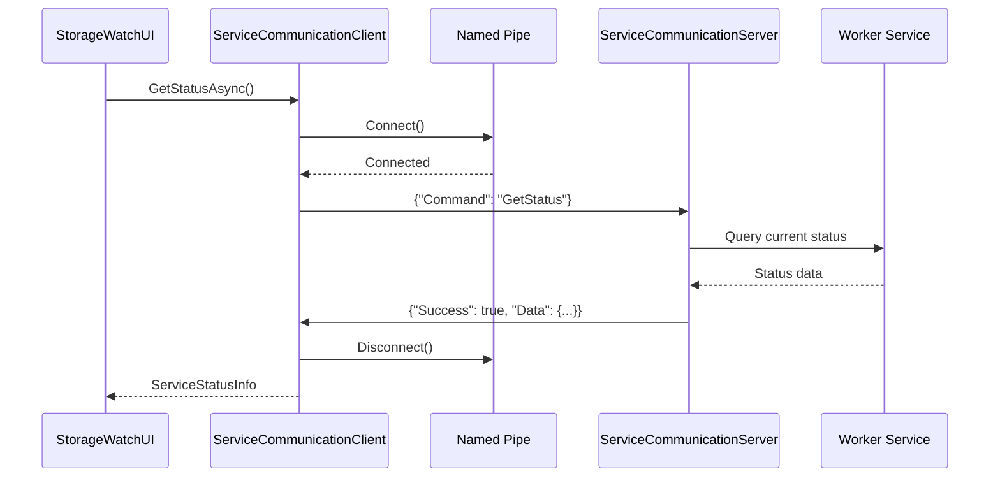
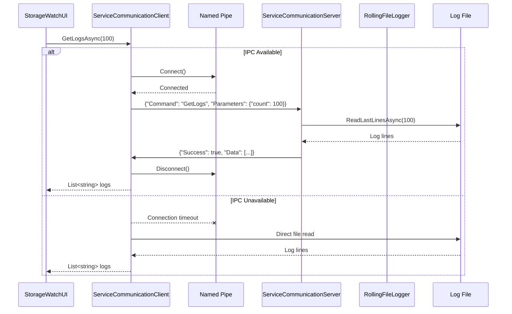
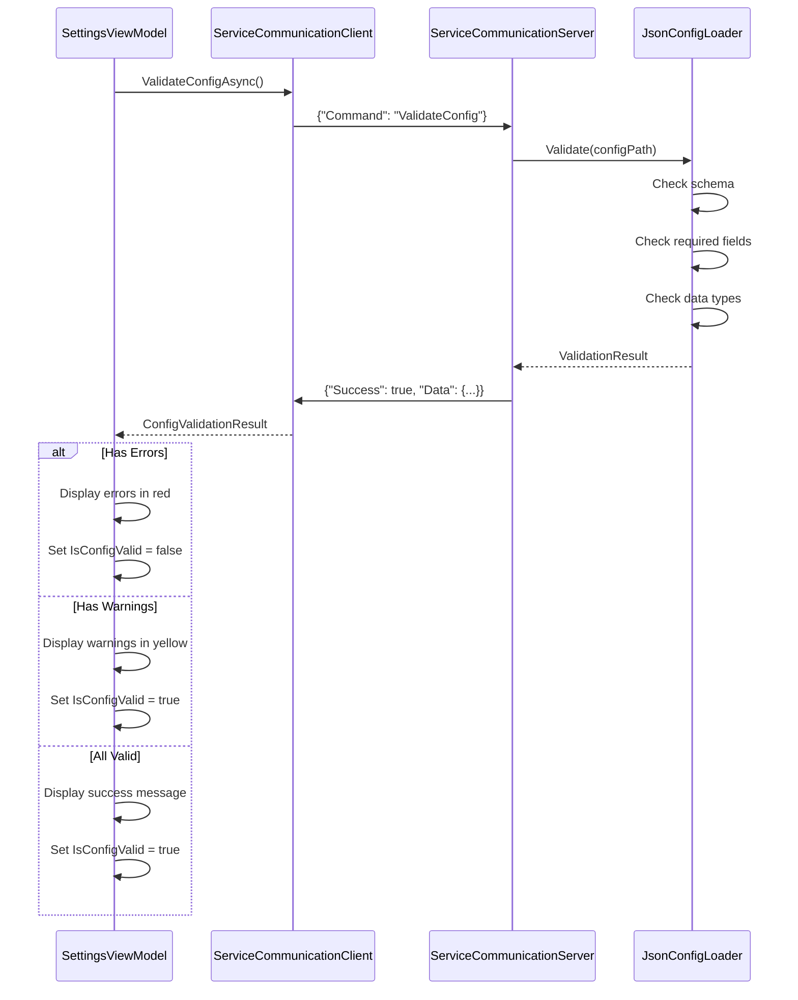
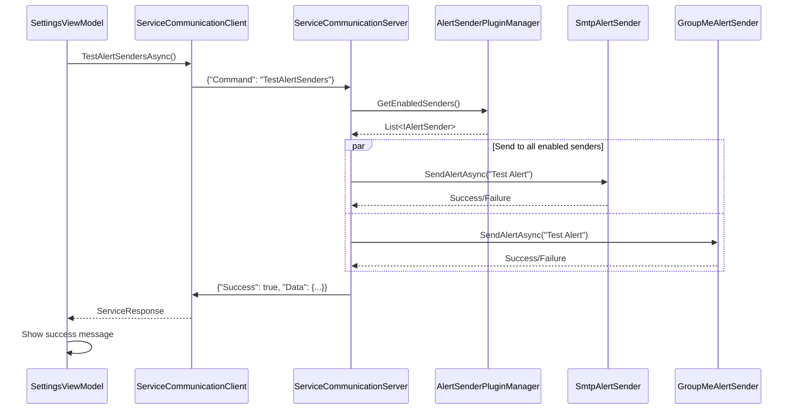
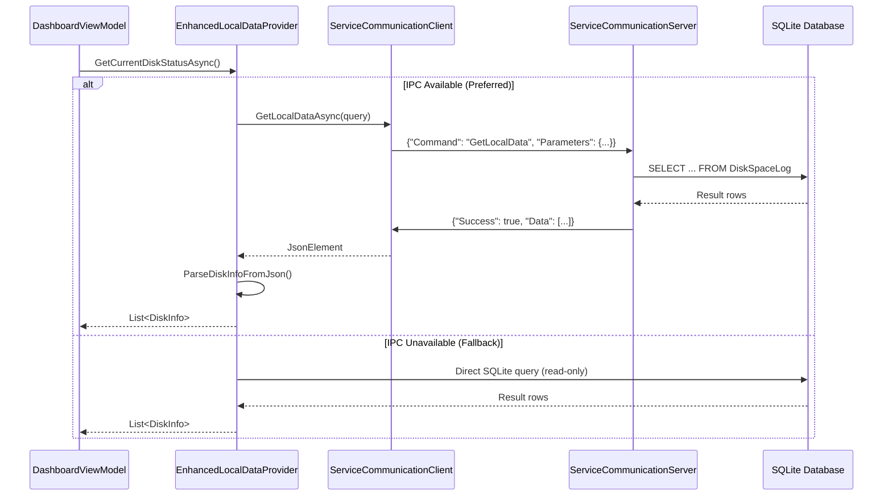
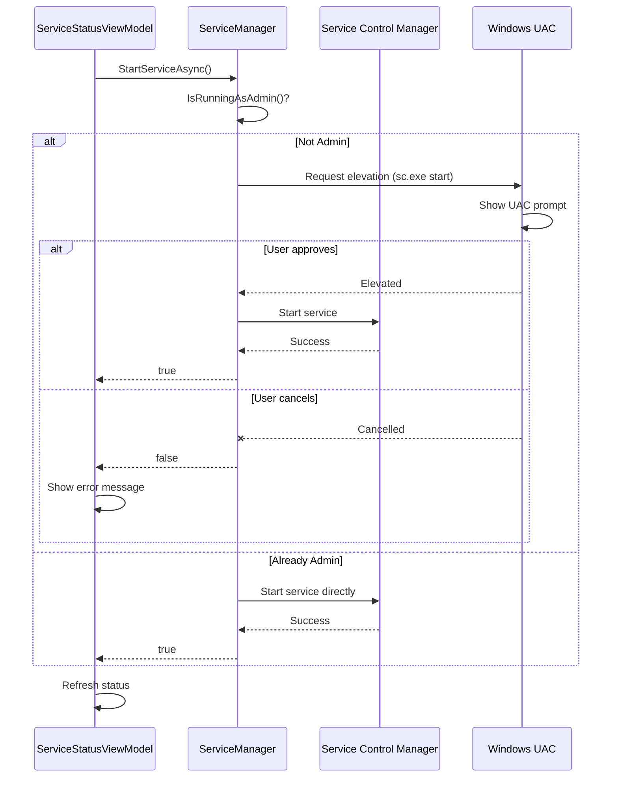
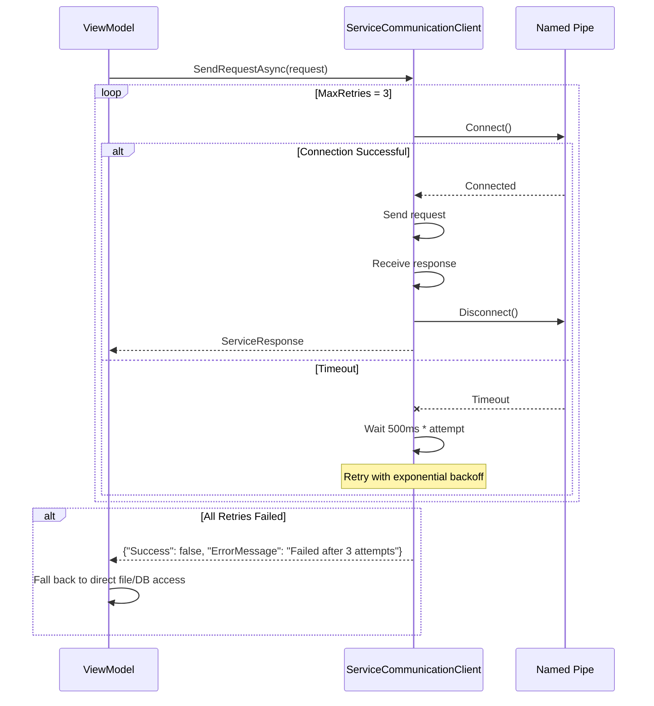

# Service Communication Sequence Diagrams

## 1. Service Status Retrieval

## 2. Log Retrieval with Fallback

## 3. Configuration Validation

## 4. Test Alert Senders

## 5. Local Data Query with IPC Optimization

## 6. Service Start with Elevation

## 7. Error Handling and Retry

## Key Design Decisions

### 1. Request-Response Pattern
Each UI operation creates a new connection, sends a request, receives a response, and disconnects. This keeps the protocol simple and stateless.

### 2. JSON Serialization
All data is serialized as JSON for:
- Human readability
- Easy debugging
- Cross-language compatibility (future)

### 3. Graceful Degradation
If IPC fails, the UI falls back to direct file system and database access. This ensures the UI remains functional even if the service is not responding.

### 4. Timeout and Retry
All operations have a 5-second timeout with 3 retry attempts. This balances responsiveness with reliability.

### 5. Asynchronous Processing
Both server and client use async/await throughout for non-blocking I/O and better scalability.
